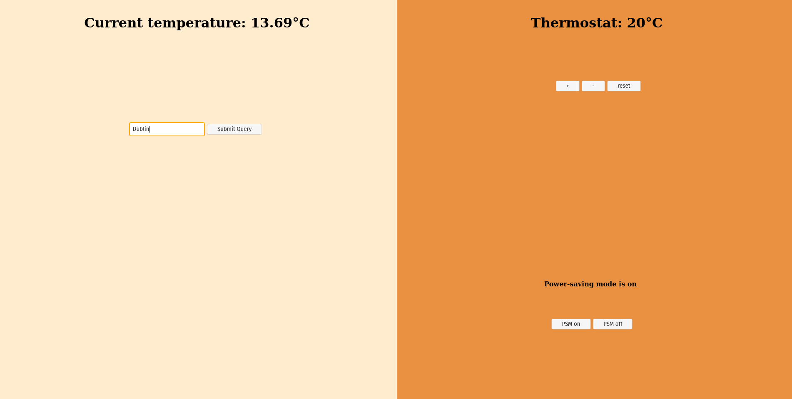
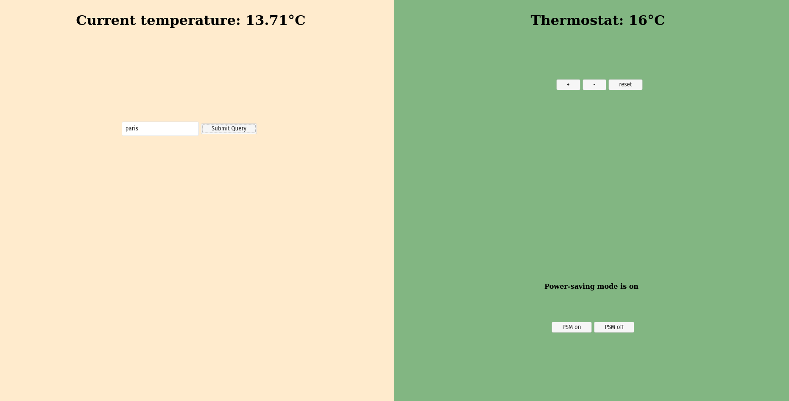
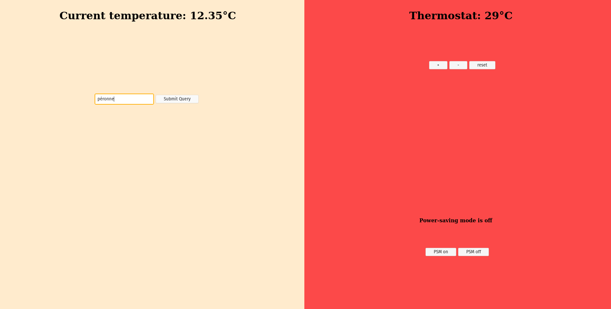

## Thermostat App

# How it Works
This thermostat-like software is a challenge from Makers Academy Bootcamp. With it, user can get the current temperature of any city and adjust a fake thermostat in consequence.  
The thermostat supports features like a "Power-Saving Mode" which prevents it from going over 25°C and color based warnings of current energy usage.
  

  

  

  

# Languages and libraries
The app has been made with JS, JQuery and Jasmine. I chose JS so that users don't have to refresh the page to use the app features.
To get information about current temperature of cities